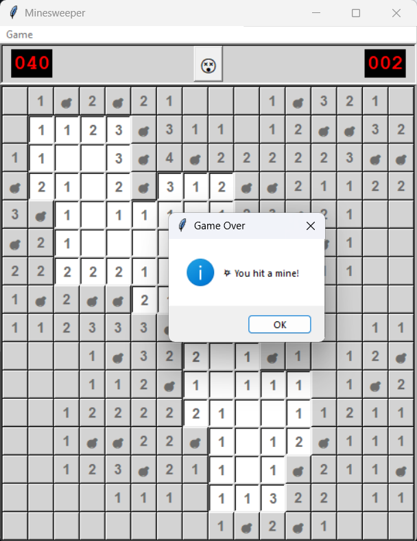

# Windows Minesweeper Clone

I tried recreating the classic Minesweeper game with Python (GUI with Tkinter), with 3 difficulty levels and the old-school Windows XP Minesweeper vibe.


## Features

- We have **three difficulty levels** as follows:
  - **Beginner**: 9x9 grid with 10 mines
  - **Intermediate**: 16x16 grid with 40 mines
  - **Expert**: 24x24 grid with 99 mines
- Clean buttons and mine conuter similar to the old-school style.
- A timer to track how fast you can win.
- Win/Loss detection with popups


## Installation & Running

1. Make sure you have **Python 3.x** installed.
2. Save the game script as `minesweeper.py`.
3. Install Tkinter (usually comes pre-installed with Python).
4. Run:

```bash
python minesweeper.py
```

## How to Play

- The goal is to uncover all cells that are **not mines**.
- Numbers indicate how many mines are adjacent to that cell.
- **Left-click** to reveal cells.
- **Right-click** to place/remove flags.
- Use **right-click** to mark suspected mines with flags.
- Win by uncovering all safe squares before clicking on a mine.
- In case of loss, the game can be reset by clicking the smiley face at the center of the toolbar.


## Screenshot

On the intermediate difficulty, the game initially looks like this:


When the user clicks on a mine we get this:




## Difficulty Settings

As stated, you can choose the difficulty when starting the game:

| Difficulty   | Grid Size  | Mines |
|--------------|-----------|-------|
| Beginner     | 9x9       | 10    |
| Intermediate | 16x16     | 40    |
| Expert       | 24x24     | 99    |


## License

This project is open-source and available for personal or educational use.


## Credits

Created by **Soham Raut**.
Inspired by the original Microsoft Minesweeper game.
